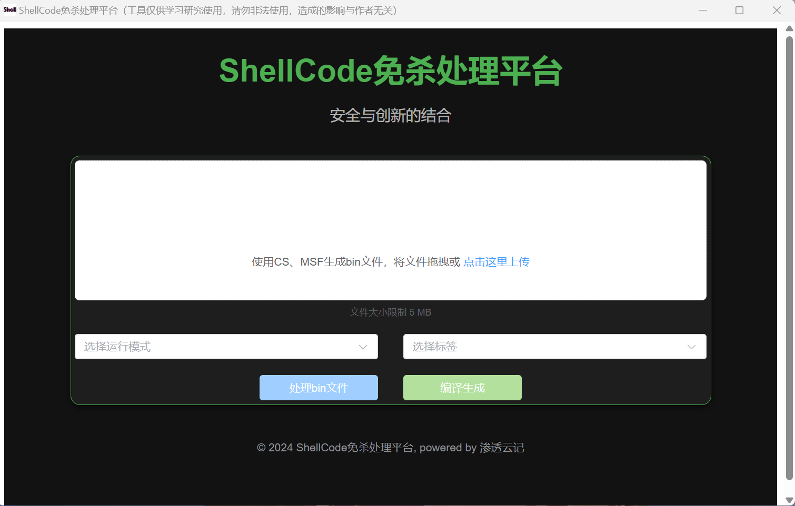
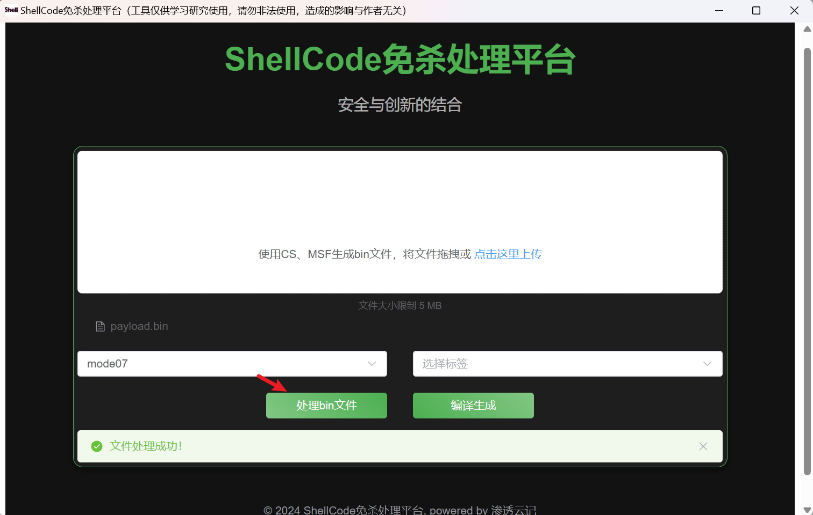
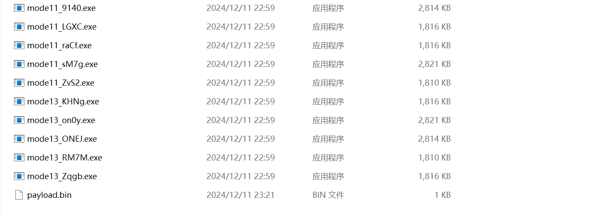
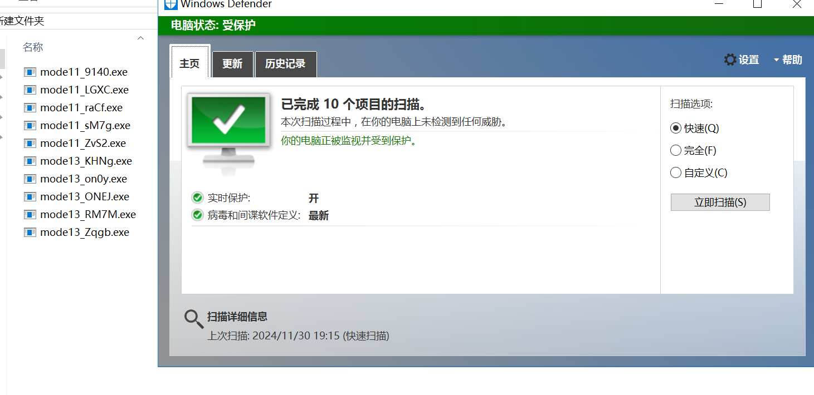
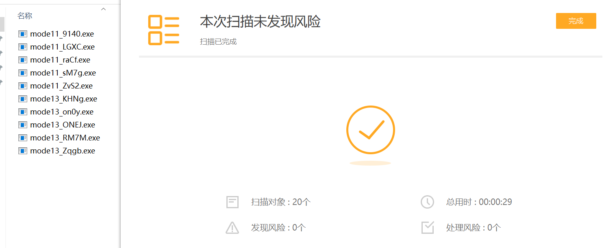
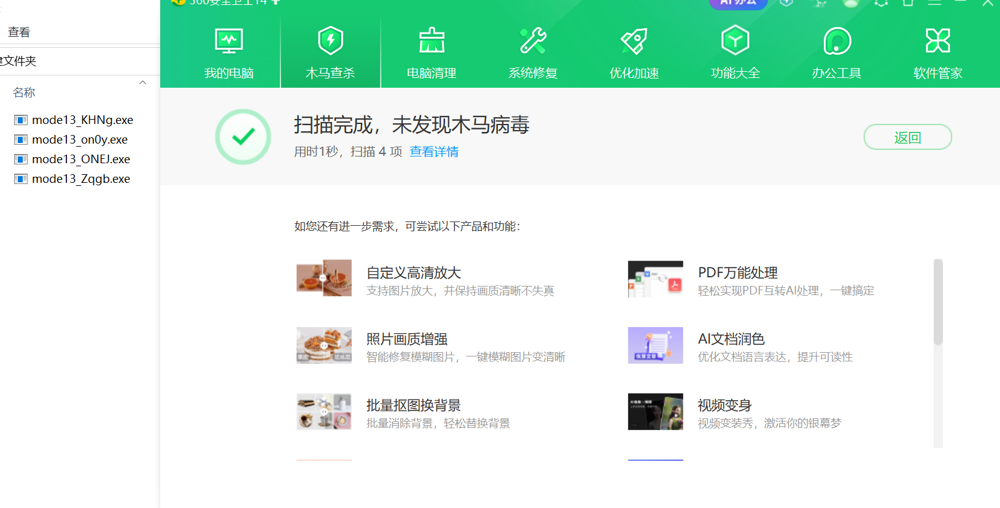
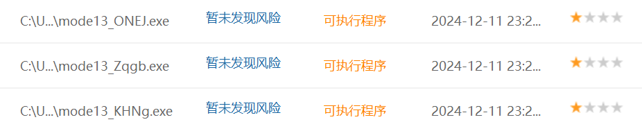

### 前言

分享一个最近折腾了好久的shellcode免杀处理平台，平台采用wails进行打包，windows用户双击即可运行生成所需文件。

目前集成模板15个，后续将增加新的处理模式。

### 环境准备

wails采用webview2运行，当系统不存在时会自动下载

1. 程序采用go生成文件，需要先行安装go环境

2. 设置go环境变量

   ~~~
   go env -w CGO_ENABLED=1
   ~~~

3. 下载go依赖包

   ~~~
   go get github.com/gonutz/ide
   go get github.com/mitchellh/go-ps
   go get golang.org/x/sys
   go get github.com/spf13/cobra
   ~~~

4. 下载gcc

~~~
https://blog.csdn.net/qq_45876765/article/details/132586631
~~~

### 使用教程

下载程序

~~~
https://github.com/doki-byte/deal_shellcode/releases/download/v1.0/ShellCode.rar
~~~

双击打开

上传生成的bin文件

点击处理bin文件

点击编译生成，等待生成完成即可

### 查杀结果

**360部分会报QVM，添加数字证书和资源文件即可**

云传结果

