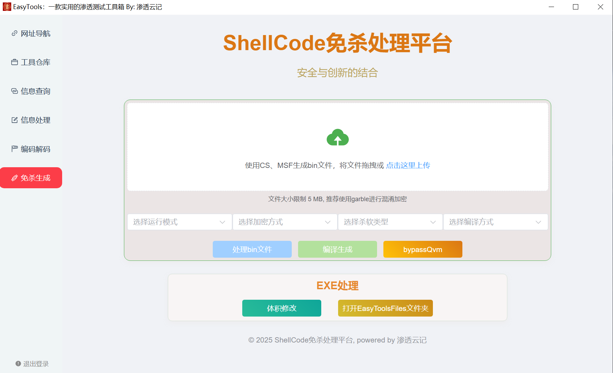
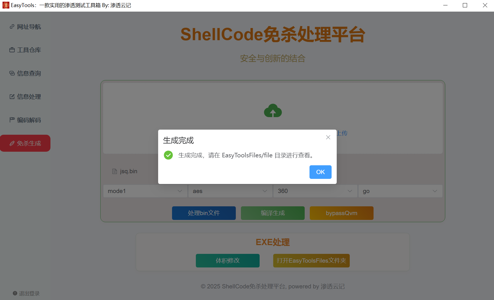

### 前言

项目目前集成至Easytools工具箱中，欢迎大家下载使用。
https://github.com/doki-byte/EasyTools

目前支持5种运行模式、2种加密方式、2种编译方式，后续将增加新的处理模式。

### 环境准备

wails采用webview2运行，当系统不存在时会自动下载

1. **程序采用go生成文件，需要先行安装go环境**
2. **下载安装本地git环境**

3. **设置go环境变量**

   ~~~
   go env -w CGO_ENABLED=1
   go env -w GO111MODULE=on
   go env -w GOPROXY=https://goproxy.cn,direct
   ~~~

4. **初始化项目**

   ~~~
   go mod init Easytools
   ~~~

5. **下载go依赖包**

   ~~~
   go get golang.org/x/sys
   go install mvdan.cc/garble@latest
   ~~~

   下载好之后，程序运行目录为如下所示即可

   

4. **下载gcc**

~~~
链接: https://pan.baidu.com/s/1EAgK403iRqJXjRvAKVqhIA?pwd=unka 提取码: unka
~~~

​	5.1.1 解压缩文件到**系统任意目录**

​	5.1.2 设置环境变量

​	重新打开 CMD 窗口，输入 gcc -v，如果能正确看到版本号，说明安装成功。

​	虚拟机测试环境为：

~~~
go	v1.24.0
gcc	v14.2.0
garble v0.14.1
~~~

### 使用教程

双击打开Easytools，选择免杀生成

选择需要处理的bin文件，拖拽进行处理

选择运行模式、加密方式、需要规避的杀软类型、编译方式

目前支持5种运行模式、2种加密方式、2种编译方式

选择完成之后，点击处理bin文件、然后编译生成

针对360Qvm报毒，可以点击bypassQvm一键对生成的文件进行处理

处理完的文件在EasyToolsFiles/file目录下，可以点击下方按钮一键打开

### 免杀监测

tips：生成文件存在黑窗口，需要手动处理一下

推荐编译方式使用garble，有点慢，请耐心等待

